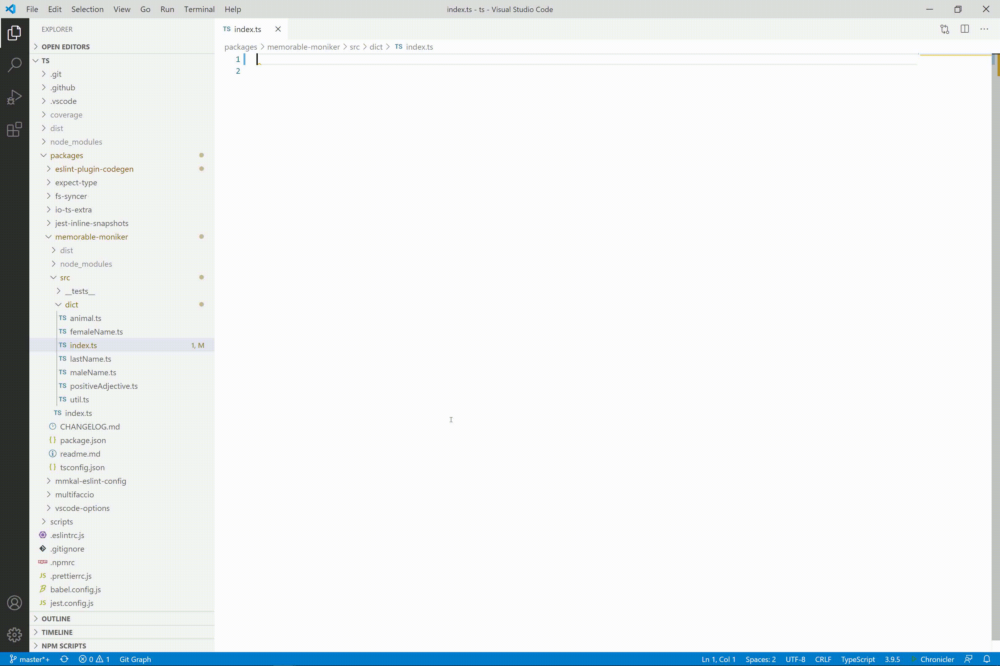
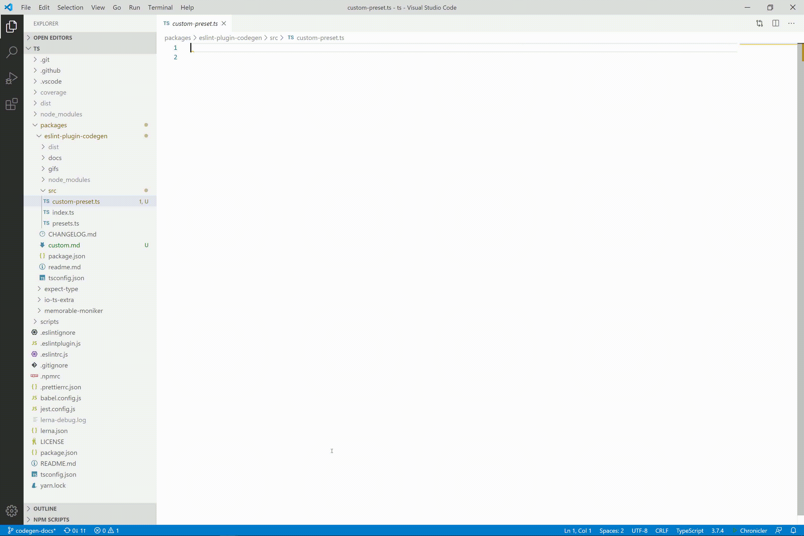

# eslint-plugin-codegen

An eslint plugin for inline codegen, with presets for barrels, jsdoc to markdown and a monorepo workspace table of contents generator. Auto-fixes out of sync code.

<!-- codegen:start {preset: badges} -->
[](https://github.com/mmkal/ts/actions?query=workflow%3A%22Node+CI%22)
[](https://codecov.io/gh/mmkal/ts/tree/main/packages/eslint-plugin-codegen)
[](https://npmjs.com/package/eslint-plugin-codegen)
<!-- codegen:end -->

## Motivation

Sometimes the same information is useful in multiple places - for example, jsdoc comments in code can double as markdown-formatted documentation for a library.

This allows generating code in a project using eslint, without having to incorporate any extra build tools, either for the codegen itself, or to validate that the generated code is up to date. So references to other parts of the project will always stay up to date - and your existing CI tools can enforce this just by running eslint.

Here's an example of it being used along with VSCode's eslint plugin, with auto-fix-on-save:


## Contents

<!-- codegen:start {preset: markdownTOC, minDepth: 2, maxDepth: 5} -->
- [Motivation](#motivation)
- [Contents](#contents)
- [How to use](#how-to-use)
   - [Setup](#setup)
   - [Presets](#presets)
      - [monorepoTOC](#monorepotoc)
      - [barrel](#barrel)
      - [markdownFromJsdoc](#markdownfromjsdoc)
      - [markdownTOC](#markdowntoc)
      - [markdownFromTests](#markdownfromtests)
      - [custom](#custom)
   - [Customisation](#customisation)
<!-- codegen:end -->

## How to use

<details>
<summary>Caveat</summary>

Before you use this, note that it's still in v0. That means:

1. Breaking changes might happen. Presets might be renamed, or have their options changed. The documentation should stay up to date though, since that's partly the point of the project.
1. There are missing features, or incompletely-implemented ones. For example, `markdownFromJsdoc` only works with `export const ...` style exports. Currently most of the features implemented are ones that are specifically needed for this git repo.
1. There might be bugs. The project is in active development - [raise an issue](https://github.com/mmkal/ts/issues) if you find one!

</details>

### Setup

In an eslint-enabled project, install with

```bash
npm install --save-dev eslint-plugin-codegen
```

or

```bash
yarn add --dev eslint-plugin-codegen
````

Then add the plugin and rule to your eslint config, for example in `eslintrc.js`:

```js
module.exports = {
  ...
  plugins: [
    ...
    'codegen'
  ],
  rules: {
    ...
    'codegen/codegen': 'error',
  },
}
```

You can use the rule by running eslint in a standard way, with something like this in an npm script: `eslint --ext .ts,.js,.md .`

In vscode, if using the eslint plugin, you may need to tell it to validate markdown files in your repo's `.vscode/settings.json` file (see [this repo for an example](../../.vscode/settings.json)):

```json
{
  "eslint.validate": ["markdown", "javascript", "typescript"],
  "editor.codeActionsOnSave": {
    "source.fixAll.eslint": true
  }
}
```

To trigger the rule, add a comment line to a source file.

In markdown:

`<!-- codegen:start {{ OPTIONS }} -->`

In typescript/javascript:

`// codegen:start {{ OPTIONS }}`

Where `{{ OPTIONS }}` are an inline object in the format:

`{preset: presetName, key1: value1, key2: value2}`

Where `key1` and `key2` are options passed to the codegen preset. yaml is used to parse the object, So any valid yaml that fits on one line can be passed as options. In practise, the one-line restriction means using [yaml's "flow style"](https://yaml.org/spec/1.2/spec.html#id2759963) for collections.

See below for documentation. This repo also has [lots of usage examples](https://github.com/mmkal/ts/search?q=%22codegen%3Astart%22&unscoped_q=%22codegen%3Astart%22).

### Presets

<!-- codegen:start {preset: markdownFromJsdoc, source: src/presets/monorepo-toc.ts, export: monorepoTOC} -->
#### [monorepoTOC](./src/presets/monorepo-toc.ts#L34)

Generate a table of contents for a monorepo.

##### Example (basic)

`<!-- codegen:start {preset: monorepoTOC} -->`

##### Example (using config options)

`<!-- codegen:start {preset: monorepoTOC, repoRoot: .., workspaces: lerna, filter: {package.name: foo}, sort: -readme.length} -->`

##### Params

|name      |description                                                                                                                                                                                |
|----------|-------------------------------------------------------------------------------------------------------------------------------------------------------------------------------------------|
|repoRoot  |[optional] the relative path to the root of the git repository. Defaults to the current md file directory.                                                                                 |
|workspaces|[optional] a string or array of globs matching monorepo workspace packages. Defaults to the `workspaces` key<br />in package.json. Set to `lerna` to parse `lerna.json`.                   |
|filter    |[optional] a dictionary of filter rules to whitelist packages. Filters can be applied based on package.json keys,<br />e.g. `filter: { package.name: someRegex, path: some/relative/path }`|
|sort      |[optional] sort based on package properties (see `filter`), or readme length. Use `-` as a prefix to sort descending.<br />e.g. `sort: -readme.length`                                     |
<!-- codegen:end -->

##### Demo


<!-- codegen:start {preset: markdownFromJsdoc, source: src/presets/barrel.ts, export: barrel} -->
#### [barrel](./src/presets/barrel.ts#L34)

Bundle several modules into a single convenient one.

##### Example

```typescript
// codegen:start {preset: barrel, include: some/path/*.ts, exclude: some/path/*util.ts}
export * from './some/path/module-a'
export * from './some/path/module-b'
export * from './some/path/module-c'
// codegen:end
```

##### Params

|name   |description                                                                                                                                                                                                                                                                                                                                                                                       |
|-------|--------------------------------------------------------------------------------------------------------------------------------------------------------------------------------------------------------------------------------------------------------------------------------------------------------------------------------------------------------------------------------------------------|
|include|[optional] If specified, the barrel will only include file paths that match this glob pattern                                                                                                                                                                                                                                                                                                     |
|exclude|[optional] If specified, the barrel will exclude file paths that match these glob patterns                                                                                                                                                                                                                                                                                                        |
|import |[optional] If specified, matching files will be imported and re-exported rather than directly exported<br />with `export * from './xyz'`. Use `import: star` for `import * as xyz from './xyz'` style imports.<br />Use `import: default` for `import xyz from './xyz'` style imports.                                                                                                            |
|export |[optional] Only valid if the import style has been specified (either `import: star` or `import: default`).<br />If specified, matching modules will be bundled into a const or default export based on this name. If set<br />to `{name: someName, keys: path}` the relative file paths will be used as keys. Otherwise the file paths<br />will be camel-cased to make them valid js identifiers.|
<!-- codegen:end -->

##### Demo



<!-- codegen:start {preset: markdownFromJsdoc, source: src/presets/markdown-from-jsdoc.ts, export: markdownFromJsdoc} -->
#### [markdownFromJsdoc](./src/presets/markdown-from-jsdoc.ts#L18)

Convert jsdoc for an es export from a javascript/typescript file to markdown.

##### Example

`<!-- codegen:start {preset: markdownFromJsdoc, source: src/foo.ts, export: bar} -->`

##### Params

|name  |description                                                                                   |
|------|----------------------------------------------------------------------------------------------|
|source|{string} relative file path containing the export with jsdoc that should be copied to markdown|
|export|{string} the name of the export                                                               |
<!-- codegen:end -->

##### Demo


<!-- codegen:start {preset: markdownFromJsdoc, source: src/presets/markdown-toc.ts, export: markdownTOC} -->
#### [markdownTOC](./src/presets/markdown-toc.ts#L17)

Generate a table of contents from the current markdown file, based on markdown headers (e.g. `### My section title`)

##### Example

`<!-- codegen:start {preset: markdownTOC, minDepth: 2, maxDepth: 5} -->`

##### Params

|name    |description                                                                                                       |
|--------|------------------------------------------------------------------------------------------------------------------|
|minDepth|exclude headers with lower "depth". e.g. if set to 2, `# H1` would be excluded but `## H2` would be included.     |
|maxDepth|exclude headers with higher "depth". e.g. if set to 3, `#### H4` would be excluded but `### H3` would be included.|
<!-- codegen:end -->

##### Demo


<!-- codegen:start {preset: markdownFromJsdoc, source: src/presets/markdown-from-tests.ts, export: markdownFromTests} -->
#### [markdownFromTests](./src/presets/markdown-from-tests.ts#L22)

Use a test file to generate library usage documentation. Note: this has been tested with jest. It _might_ also work fine with mocha, and maybe ava, but those haven't been tested.

##### Example

`<!-- codegen:start {preset: markdownFromTests, source: test/foo.test.ts, headerLevel: 3} -->`

##### Params

|name       |description                                           |
|-----------|------------------------------------------------------|
|source     |the jest test file                                    |
|headerLevel|The number of `#` characters to prefix each title with|
<!-- codegen:end -->

##### Demo


<!-- codegen:start {preset: markdownFromJsdoc, source: src/presets/custom.ts, export: custom} -->
#### [custom](./src/presets/custom.ts#L26)

Define your own codegen function, which will receive all options specified. Import the `Preset` type from this library to define a strongly-typed preset function:

##### Example

```typescript
import {Preset} from 'eslint-plugin-codegen'

export const jsonPrinter: Preset<{myCustomProp: string}> = ({meta, options}) => {
  return 'filename: ' + meta.filename + '\\ncustom prop: ' + options.myCustomProp
}
```

This can be used with:

`<!-- codegen:start {preset: custom, source: ./lib/my-custom-preset.js, export: jsonPrinter, myCustomProp: hello}`

##### Params

|name  |description                                                                       |
|------|----------------------------------------------------------------------------------|
|source|Relative path to the module containing the custom preset                          |
|export|The name of the export. If omitted, the module itself should be a preset function.|
<!-- codegen:end -->

##### Demo



Note: right now, this preset isn't smart enough to follow source maps or transpile code, so `source` should point at compiled javascript, not typescript. And VSCode's eslint plugin caches modules, so if you edit the custom preset, you may need to recompile and reload VSCode for it to work properly. 

### Customisation

In addition to the [custom](#custom) preset, you can also define your own presets in eslint configuration, e.g.:

```js
module.exports = {
  ...
  plugins: [
    ...
    'codegen'
  ],
  rules: {
    ...
    'codegen/codegen': [
      'error',
      {presets: require('./my-custom-presets')}
    ],
  },
}
```

`presets` should be a record of preset functions, conforming to the `Preset` interface from this package. This can be used to extend the in-built ones. For example, you could make generated markdown collapsible:

_Before:_

```
 <!-- codegen:start {preset: markdownTOC}-->
 - [Section1](#section1)
 - [Section2](#section2)
 <!-- codegen:end -->
```

`my-custom-presets.js`:

```js
const {presets} = require('eslint-plugin-codegen')

module.exports.markdownTOC = (params) => {
  const toc = presets.markdownTOC(params)
  return [
    '<details>',
    '<summary>click to expand</summary>',
    '',
    toc,
    '</details>',
  ].join('\n')
}
```

`.eslintrc.js`:

```js
module.exports = {
  ...
  plugins: [
    ...
    'codegen'
  ],
  rules: {
    ...
    'codegen/codegen': ['error', {presets: require('./my-custom-presets')}],
  },
}
```

_After_:

`readme.md`:

```
 <!-- codegen:start {preset: markdownTOC}-->
 <details>
  <summary>click to expand</summary>

 - [Section1](#section1)
 - [Section2](#section2)
 </details>
 <!-- codegen:end -->
```

_Rendered_:

<details>
<summary>click to expand</summary>

- [Section1](#section1)
- [Section2](#section2)
</details>
